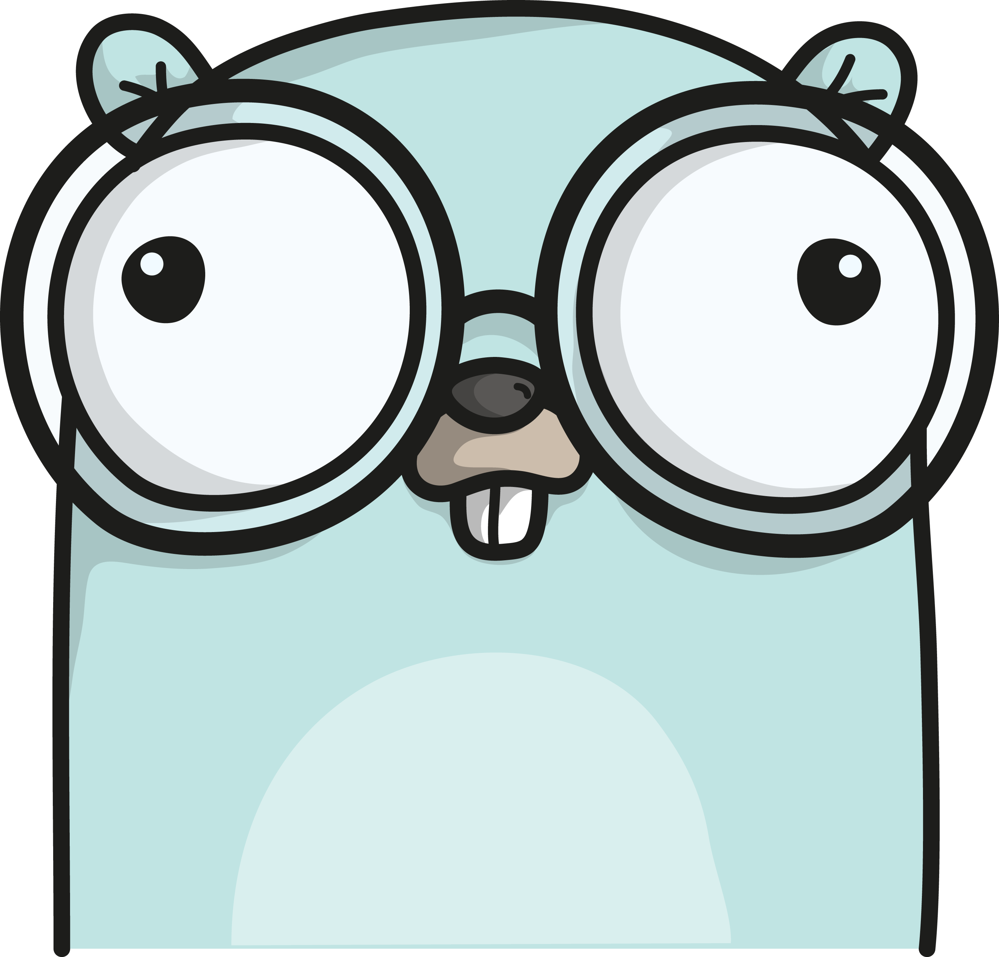

class: center, middle

# Golang Training

## Welcome!



???
Some note.

---

layout: true

.headline[Golang Training · Welcome!]

---

# Only valid with a gopher.


---

# What is Golang?

* It is a programming language, comprehensive runtime and build system.
* It will be directly translated to target machine code.
  * Similar to _C_, _C++_ and _Rust_
  * But in contrast to _PHP_ and _JavaScript_ which is interpreted at runtime
  * And in contrast to _Java_ and _C#_ which is translated to VM code and at runtime interpreted.
* The built result will always be shipped as an executable .reference[1)]
* It is really cross platform, because the dependencies are platform independent, too. .reference[1)]

.footnote[1) Some rare exceptions exists]

---

# Origins

* Initially developed by Google
* Born out of frustration about undue complexity of the languages back in 2007
* Should address the following points at the same time:
  1. Efficient compilation
  2. Efficient execution
  3. Ease of programming

---

# Principles

* Extreme static typed .hint[(at compile- and build-time)]
* Garbage collected .hint[(but still always with a very small memory footprint)]
* Concurrency is a language feature .hint[(not just part of the SDK)]
* Somehow and somehow not functional and object-oriented
  <br>- it is cherry-picking from many concepts and create a new one out of it.
* [Composition over inheritance](https://en.wikipedia.org/wiki/Composition_over_inheritance)
* Works with passing by _value_ or _pointer_ .hint[or for Java people by _copy_ or _reference_].
* Minimalistic languages syntax but several naming conventions.

---

# What are the dependencies at build time?

1. A Golang SDK
   * Could be downloaded from [golang.org/dl](https://golang.org/dl/)
   * Available for Linux, FreeBSD, macOS .hint[(darwin)] and Windows

That's it!

---

# Why is not more required at build time? .reference[1)]

* Golang is always built from sources; this includes:
  * Everything in the SDK itself
  * and every included library .reference[2)]
* All dependencies are hosted via Git, SVN, Bazaar repositions
* Golang will download all required dependencies at build time automatically .hint[(if required)]
* Golang can compile and link itself without the need of platform tools of Linux, macOS or Windows

.footnote[1) If [Go Modules](https://github.com/golang/go/wiki/Modules) is enabled which are available from Go 1.11 on - this is highly recommended]
.footnote[2) Exceptions are possible if in extreme rare situations are static libraries are used]

---

# Biggest benefit about Golang's SDK and libraries

* Everything .reference[1)] is reimplemented in Golang standalone and cross platform.
* SDK includes (for example):
  * HTTP Client and Server
  * Encryption (including TLS, RSA, ... up to the latest versions)
  * Low level interactions with the Kernel
  * JSON, XML, ... (un)marshaller
* And many libraries providing huge amount of more stuff

.footnote[1) Exceptions are really rare]

---

# Biggest benefit about Golang's SDK and libraries

* This is a contrast to Ruby and Python where many stuff is based on static libraries
  which you have to install dedicated.
* But very similar to Java and C# where external static libraries are extreme rare.

<br>
<br>
<br>
<br>
<br>
<br>
<br>
Hint: The Golang community likes libraries with external static<br>dependencies very much. .hint[<- Sarcasm]


---

# What are the dependencies at runtime time?

* Nothing - just your build binary. .reference[1)]
  * Because everything is static linked.
  * On Linux just the Kernel is enough and a complete empty filesystem.
  * In Docker images you can use `FROM scratch`
* Common exceptions are just what other files you need (like HTML, CSS, ...)
  <br/>But you can also pack them into the binary (using tools like [`packr`](https://github.com/gobuffalo/packr))

.footnote[1) If build with `CGO_ENABLED=0`]

---

# What are potential build targets?

The better question is: Where it does not run natively?

* **Operating Systems**: AIX, **Android**, **macOS**, DragonFly, FreeBSD, Hurd, Illumos, **JavaScript**, **Linux**, Google Native Client, NetBSD, OpenBSD, Plan9, Solaris, **Windows**, ZOS
* **Architectures**: **`386`**, **`amd64`**, `amd64p32`, **`arm`**, `armbe`, `arm64`, `ppc64`, `ppc64le`, `mips`, `mipsle`, `mips64`, `mips64le`, `mips64p32`, `mips64p32le`, `ppc`, `riscv`, `riscv64`, `s390`, `s390x`, `sparc`, `sparc64`, **`wasm`**
* You can build each target from each build system (`linux->windows`, `windows->macOS`, ...)

...yes, it runs natively in the browser too. Thanks to [WebAssembly](https://webassembly.org/).

---

# What is a good developer machine setup to start? .reference[1)]

1. **Operating system**: Linux, macOS or Windows
2. **SDK**: Latest from [golang.org/dl](https://golang.org/dl/); ensure environment variables:
   ```bash
   # This is usually automatically set using the installers
   GOROOT=/opt/go    # Where Go is installed
   GOPATH=$HOME/go   # go path in your home directory
   PATH=${PATH}:${GOROOT}/bin:${GOPATH}/bin
   ```
3. **IDE**: Either [GoLand](https://www.jetbrains.com/go) or [IntelliJ IDEA Ultimate](https://www.jetbrains.com/idea)
4. **Shell**: Any build platform native works

.footnote[1) My recommendation]

---

# What does a very simple project look like?

In Golang you can directly run single files: .reference[1)]

1. Create file `sample.go`:
  ```go
  package main

  import "fmt"

  func main() {
  	fmt.println("Hello, world!")
  }
  ```
2. Build it (while in the folder):
   * With `go build sample.go`; will create executable `sample`
   * Or run directly with `go run sample.go`

.footnote[1) The project with this setup cannot have dependencies except from the SDK.]

---

# Waht does a typical project look like?

1. Structure:
    ```bash
    myProject     # Root folder of the project
     + packageA
     | + foo.go   # File which are in the packageA functions, types, ...
     + packageB
     | + bar.go   # File which are in the packageB functions, types, ...
     + main.go    # File which will contain the main.main function
     + go.mod     # Go Module specification file to define module name, dependencies, ...
     + go.sum     # Go Module checksum file

    ```
2. Build it (while in the folder):
   * With `go build .`; will create executable `myProject`
   * Or run directly with `go run .`

---

# What is the `go.mod` file?

* Waht it looks like?
    ```bash
    module github.com/blaubaer/my-great-project

    require (
        github.com/gobuffalo/packr v1.22.0
        github.com/sirupsen/logrus v1.3.0
    )
    ```
* It defines the name of the module; which is usually the path to the repository .hint[without https:// prefix and .git suffix]
* A list of other modules in the same name pattern,
  <br/>followed by a version number which is a corresponding tag (`v\d+\.\d+\.\d+`) in the repository.

.hint[Full documentation: [Go Modules](https://github.com/golang/go/wiki/Modules)]

---

# How to manage `go.mod`?

* To create it just call (inside the project folder) `go mod init <name>`
  <br>example: `go mod init github.com/blaubaer/my-great-project`
* Add new and remove abandon dependencies: This is done automatically the command `go mod tidy`
  will look in all `*.go` files for all `import (...)` statements and will add or remove lines in
  `go.mod` accordingly.
  <br>On add it will take the latest version from the external repository by default.
* Use specific version? Just change this version directly inside `go.mod`
* See dependency graph? Call `go mod graph`

.hint[More stuff: Call `go help mod` and visit [Go Modules](https://github.com/golang/go/wiki/Modules)]

---

# What is the `go.sum` file?

* Contains checksums for every required external module
* It ensure no unexpected change of the external dependencies
* Automatically maintained by Golang

.hint[Full documentation: [Go Modules](https://github.com/golang/go/wiki/Modules)]

---

class: center, middle


# Lesson done!

Questions? [Do not hesitate to contact me!](https://github.com/blaubaer)

Moving on to next lesson: [Basics](https://golang.training.noczin.ski/basics/)

---

# Credits

* Author: [Gregor Noczinski](https://github.com/blaubaer) VP of Engineering @[LEVERTON GmbH](https://github.com/levertonai)
* Special thanks to: [Anthony Ruffino](https://github.com/AnthonyRuffino) Full Stack Engineer @[LEVERTON GmbH](https://github.com/levertonai)
* Gophers: [Gopher Artwork by Ashley McNamara](https://github.com/ashleymcnamara/gophers)


